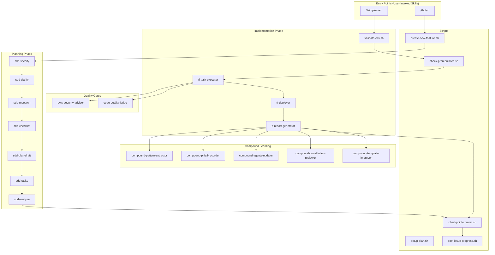

# Terraform Workflow Architecture Mind Map

This document visualizes the connections between agents, skills, templates, and scripts in the SDD (Spec-Driven Development) workflow.

---

## Visual Overview

```
┌─────────────────────────────────────────────────────────────────────────────────────┐
│                              WORKFLOW ORCHESTRATION                                  │
│  ┌─────────────────┐                                    ┌─────────────────┐         │
│  │   /tf-plan      │──────────────────────────────────▶│  /tf-implement   │         │
│  │   (skill)       │                                    │    (skill)       │         │
│  └────────┬────────┘                                    └────────┬────────┘         │
│           │                                                      │                   │
│           ▼                                                      ▼                   │
│  ┌────────────────────────────────────────────┐  ┌────────────────────────────────┐ │
│  │         PLANNING PHASE                      │  │      IMPLEMENTATION PHASE      │ │
│  │  sdd-specify → sdd-clarify → sdd-research  │  │  tf-task-executor → tf-deployer│ │
│  │  sdd-checklist → sdd-plan-draft → sdd-tasks│  │  tf-report-generator            │ │
│  │  sdd-analyze                                │  │  aws-security-advisor          │ │
│  │                                             │  │  code-quality-judge             │ │
│  └────────────────────────────────────────────┘  └────────────────────────────────┘ │
│                                                                    │                 │
│                                                                    ▼                 │
│                                                  ┌────────────────────────────────┐ │
│                                                  │      COMPOUND LEARNING         │ │
│                                                  │  compound-pattern-extractor    │ │
│                                                  │  compound-pitfall-recorder     │ │
│                                                  │  compound-agents-updater       │ │
│                                                  │  compound-constitution-reviewer│ │
│                                                  │  compound-template-improver    │ │
│                                                  └────────────────────────────────┘ │
└─────────────────────────────────────────────────────────────────────────────────────┘
```

---

## Component Directories

| Directory | Purpose | Count |
|-----------|---------|-------|
| `.claude/agents/` | Agent behavior definitions (Task tool subagent_type) | 17 agents |
| `.claude/skills/` | Domain knowledge & patterns (Skill tool) | 17 skills |
| `.foundations/templates/` | Artifact structure templates | 9 templates |
| `.foundations/scripts/bash/` | Automation & utility scripts | 8 scripts |

---

## Agent → Skill Mapping

```
┌──────────────────────────────────────────────────────────────────────────────────────┐
│                               PLANNING AGENTS                                         │
├─────────────────────┬───────────────────────────────────────────────────────────────┤
│ sdd-specify         │ ←── tf-spec-writing (user story formats, requirement rules)   │
│ sdd-clarify         │ ←── tf-domain-taxonomy (8-category ambiguity scan)            │
│ sdd-research        │ ←── tf-research-heuristics (registry search strategies)       │
│ sdd-checklist       │ ←── tf-checklist-patterns (requirement quality tests)         │
│ sdd-plan-draft      │ ←── tf-architecture-patterns (module selection, patterns)     │
│ sdd-tasks           │ ←── tf-task-patterns (phase organization, dependencies)       │
│ sdd-analyze         │ ←── tf-consistency-rules (cross-artifact traceability)        │
└─────────────────────┴───────────────────────────────────────────────────────────────┘

┌──────────────────────────────────────────────────────────────────────────────────────┐
│                            IMPLEMENTATION AGENTS                                      │
├─────────────────────┬───────────────────────────────────────────────────────────────┤
│ tf-task-executor    │ ←── tf-implementation-patterns + terraform-test               │
│ tf-deployer         │ ←── tf-implementation-patterns                                │
│ tf-report-generator │ ←── tf-report-template                                        │
└─────────────────────┴───────────────────────────────────────────────────────────────┘

┌──────────────────────────────────────────────────────────────────────────────────────┐
│                              QUALITY AGENTS                                           │
├─────────────────────┬───────────────────────────────────────────────────────────────┤
│ aws-security-advisor│ ←── tf-security-baselines (CIS/NIST, risk ratings)            │
│ code-quality-judge  │ ←── tf-judge-criteria (6-dimension scoring rubric)            │
└─────────────────────┴───────────────────────────────────────────────────────────────┘

┌──────────────────────────────────────────────────────────────────────────────────────┐
│                              COMPOUND AGENTS                                          │
├─────────────────────┬───────────────────────────────────────────────────────────────┤
│ compound-pattern-*  │ ←── tf-compound-patterns (all 5 compound agents share this)   │
│ compound-pitfall-*  │                                                               │
│ compound-agents-*   │                                                               │
│ compound-template-* │                                                               │
│ compound-const-*    │                                                               │
└─────────────────────┴───────────────────────────────────────────────────────────────┘
```

---

## Agent → Template Mapping

```
┌─────────────────────────────────────────────────────────────────────────────────────┐
│  AGENT                   │  CREATES/USES TEMPLATE          │  OUTPUT ARTIFACT       │
├─────────────────────────┼─────────────────────────────────┼───────────────────────┤
│  sdd-specify            │  spec-template.md               │  specs/{F}/spec.md    │
│  sdd-plan-draft         │  plan-template.md               │  specs/{F}/plan.md    │
│                         │  contracts-template.md          │  specs/{F}/contracts/ │
│  sdd-tasks              │  tasks-template.md              │  specs/{F}/tasks.md   │
│  sdd-checklist          │  checklist-template.md          │  specs/{F}/checklists/│
│  code-quality-judge     │  code-quality-evaluation-       │  specs/{F}/evaluations│
│                         │    report.md                    │    /code-review-*.md  │
│  tf-report-generator    │  deployment-report-template.md  │  specs/{F}/reports/   │
│  compound-agents-updater│  agent-definition-template.md   │  .claude/CLAUDE.md    │
└─────────────────────────────────────────────────────────────────────────────────────┘
```

---

## Script → Workflow Integration

```
┌─────────────────────────────────────────────────────────────────────────────────────┐
│                             SCRIPT DEPENDENCY TREE                                   │
│                                                                                      │
│                              ┌──────────────┐                                       │
│                              │  common.sh   │ ◀── Foundation (sourced by all)       │
│                              └──────┬───────┘                                       │
│           ┌──────────────────────┬──┴──┬──────────────────────┐                    │
│           ▼                      ▼     ▼                      ▼                    │
│  ┌─────────────────┐   ┌──────────────┐ ┌──────────────┐  ┌────────────────┐       │
│  │create-new-      │   │setup-plan.sh │ │check-        │  │update-agent-   │       │
│  │feature.sh       │   │              │ │prerequisites │  │context.sh      │       │
│  └─────────────────┘   └──────────────┘ │.sh           │  └────────────────┘       │
│                                         └──────────────┘                            │
│                                                                                      │
│  ┌─────────────────────────────────────────────────────────────────────────────┐   │
│  │                        STANDALONE SCRIPTS                                    │   │
│  │  validate-env.sh ──── GATE/WARN checks (TFE_TOKEN, GITHUB_TOKEN, etc.)      │   │
│  │  checkpoint-commit.sh ── Atomic git commits after workflow phases           │   │
│  │  post-issue-progress.sh ── GitHub issue progress tracking                   │   │
│  └─────────────────────────────────────────────────────────────────────────────┘   │
└─────────────────────────────────────────────────────────────────────────────────────┘
```

---

## Workflow Execution Flow



---

## Key Relationships Summary

### 1. Skills Provide Knowledge to Agents
Skills are **preloaded domain knowledge** that agents use for decision-making:
- `tf-spec-writing` → tells `sdd-specify` how to write specifications
- `tf-judge-criteria` → tells `code-quality-judge` how to score code
- `tf-compound-patterns` → tells all compound agents how to capture learnings

### 2. Templates Define Output Structure
Templates are **artifact schemas** that agents fill in:
- `spec-template.md` → structure for `spec.md`
- `deployment-report-template.md` → structure for deployment reports

### 3. Scripts Automate Workflow Steps
Scripts handle **infrastructure automation**:
- `create-new-feature.sh` → creates branch + copies spec template
- `validate-env.sh` → gates implementation on required tokens
- `checkpoint-commit.sh` → commits artifacts after each phase
- `post-issue-progress.sh` → posts updates to GitHub issues

### 4. Orchestrator Skills Coordinate Everything
Two top-level skills drive the workflow:
- `/tf-plan` → orchestrates specification → planning → tasks
- `/tf-implement` → orchestrates task execution → deployment → learning

---

## File Locations Quick Reference

```
.claude/
├── agents/                    # 17 agent definitions
│   ├── sdd-specify.md
│   ├── sdd-clarify.md
│   ├── sdd-research.md
│   ├── sdd-checklist.md
│   ├── sdd-plan-draft.md
│   ├── sdd-tasks.md
│   ├── sdd-analyze.md
│   ├── tf-task-executor.md
│   ├── tf-deployer.md
│   ├── tf-report-generator.md
│   ├── aws-security-advisor.md
│   ├── code-quality-judge.md
│   └── compound-*.md (5 files)
│
└── skills/                    # 17 skill definitions
    ├── tf-plan/SKILL.md       # Planning orchestrator
    ├── tf-implement/SKILL.md  # Implementation orchestrator
    ├── tf-spec-writing/SKILL.md
    ├── tf-domain-taxonomy/SKILL.md
    ├── tf-research-heuristics/SKILL.md
    ├── tf-checklist-patterns/SKILL.md
    ├── tf-task-patterns/SKILL.md
    ├── tf-consistency-rules/SKILL.md
    ├── tf-implementation-patterns/SKILL.md
    ├── tf-architecture-patterns/SKILL.md
    ├── tf-judge-criteria/SKILL.md
    ├── tf-security-baselines/SKILL.md
    ├── tf-report-template/SKILL.md
    ├── tf-compound-patterns/SKILL.md
    ├── terraform-test/SKILL.md
    ├── terraform-style-guide/SKILL.md
    └── tf-e2e-tester/SKILL.md

.foundations/
├── templates/                 # 9 artifact templates
│   ├── spec-template.md
│   ├── plan-template.md
│   ├── tasks-template.md
│   ├── checklist-template.md
│   ├── contracts-template.md
│   ├── deployment-report-template.md
│   ├── code-quality-evaluation-report.md
│   ├── agent-definition-template.md
│   └── skill-definition-template.md
│
├── scripts/bash/              # 8 automation scripts
│   ├── common.sh              # Shared utilities
│   ├── create-new-feature.sh  # Branch + spec creation
│   ├── setup-plan.sh          # Plan initialization
│   ├── check-prerequisites.sh # Validation
│   ├── validate-env.sh        # Token checks
│   ├── checkpoint-commit.sh   # Git commits
│   ├── post-issue-progress.sh # GitHub updates
│   └── update-agent-context.sh# AI context files
│
├── diagrams/                  # Workflow visualizations
│   ├── mindmap_architecture.md
│   ├── tf-plan-flow-v3.mmd
│   ├── tf-plan-flow-v4.mmd
│   ├── tf-plan-flow-v4.html
│   ├── tf-implement-flow-v4.mmd
│   └── tf-implement-flow-v4.html
│
└── memory/                    # Constitution and compound learning outputs
    ├── constitution.md
    ├── constitution_template.md
    ├── patterns/
    ├── pitfalls/
    └── reviews/
```

---

## How Components Invoke Each Other

| Invocation Method | From | To | Example |
|-------------------|------|-----|---------|
| `Task` tool | Orchestrator | Agent | `Task(subagent_type="sdd-specify")` |
| `Skill` tool | User/Orchestrator | Skill | `Skill(skill="/tf-plan")` |
| `Bash` tool | Agent | Script | `Bash("./create-new-feature.sh")` |
| `Read` tool | Agent | Template | `Read(".foundations/templates/spec-template.md")` |
| `Write` tool | Agent | Artifact | `Write("specs/{F}/spec.md")` |
